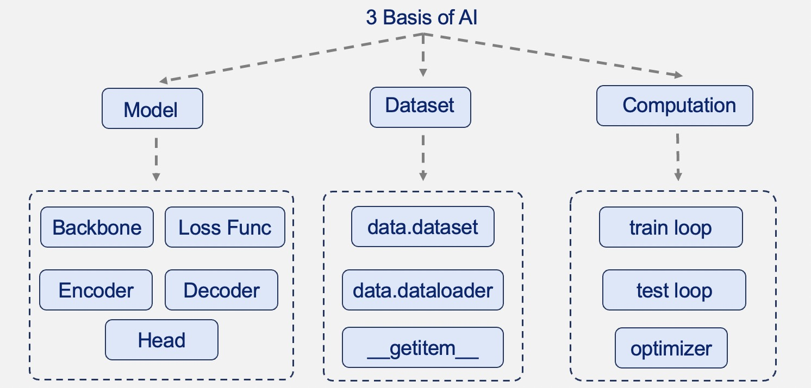
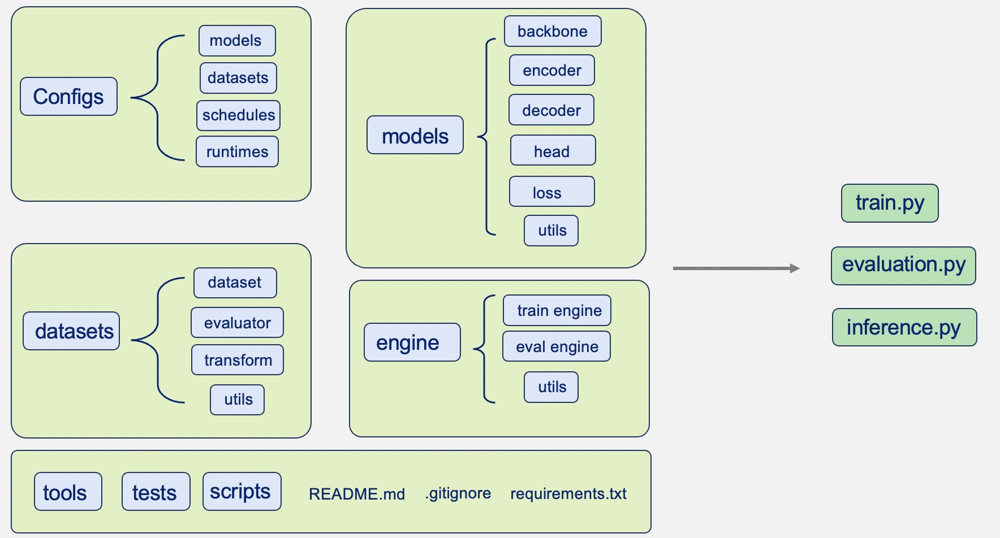

# Cookbook to Craft Good Code
Think of good code like a classic, well-fitting piece of clothing—it never goes out of style. Coding is both a science and an art, where neatness and logic come together. What makes some code stand out as great? Here are three key aspects:
- **Readability**:
  -  Good code should be easy to read and understand. This means using clear naming conventions, organizing code logically, and commenting where necessary to explain complex parts.
- **Simplicity and Efficiency**:
  -  Good code often follows the KISS principle ("Keep It Simple, Stupid"). It should accomplish its tasks in the simplest way possible, without unnecessary complexity.
  -  Efficient code also performs its tasks quickly and resourcefully.
- **Maintainability**:
  - Code should be easy to maintain and modify. This involves writing modular code, where different parts of the program are separated into distinct sections or functions that can be updated independently.
  
In this guide, we'll dive into the essentials of crafting great code. We'll go through everything from how to name things clearly and highlight tools that make coding better and easier. 

### Contents
- [Cookbook to Craft Good Code](#cookbook-to-craft-good-code)
    - [Contents](#contents)
  - [1. Readability](#1-readability)
    - [Docstring](#docstring)
    - [Type Hinting](#type-hinting)
    - [Naming Conventions](#naming-conventions)
    - [Formatting](#formatting)
  - [2. Simplicity and Efficiency](#2-simplicity-and-efficiency)
    - [KISS Principle](#kiss-principle)
    - [Write Efficient Code](#write-efficient-code)
  - [3. Maintainability](#3-maintainability)
    - [Use Registry Mechanism to Manage Your Code](#use-registry-mechanism-to-manage-your-code)
    - [Organize Your Code by Functionality](#organize-your-code-by-functionality)


## 1. Readability
Readability in code is akin to clear handwriting in a letter. It's not just about what you write, but how you present it. A well-written piece of code should speak to its reader, guiding them through its logic as effortlessly as a well-told story. Let's delve into some of the key practices that make code readable.

### Docstring
A docstring, short for "documentation string," is a string literal that occurs as the first statement in a module, function, class, or method definition. Here are three most important definitions from the official Python documentation, [PEP257](https://peps.python.org/pep-0257/).

<details open>
<summary><strong>Python PEP257</strong></summary>

- **1. What Should be Documented**:
  - PEP 257 suggests that ***all public modules, functions, classes, and methods should have docstrings***. Private methods (those starting with an underscore) are considered optional for documentation but are encouraged, especially for complex code.

- **2. Docstring Format**:
  - Docstrings should be enclosed in triple double quotes (""").
  - The first line should be a short, concise summary of the object’s purpose.

- **3. Multi-line Docstrings**:
  - For longer descriptions, the summary line should be followed by a blank line, then a more elaborate description. The detailed description may include usage, arguments, return values, and raised exceptions if applicable.
  - Multi-line docstrings should end with the closing triple quotes on a line by themselves.

</details>

Here are two python templates for docstring of function and class that may give you a more concrete idea of how to write a docstring.

<details open>
<summary><strong>Template for function</strong></summary>

  ```python
  def function_name(param1, param2, ...):
      """A brief description of what the function does.

      A more detailed description of the function if necessary.

      Inputs:
          param1 (Type): Description of param1.
          param2 (Type): Description of param2.

      Returns:
          ReturnType: Description of the return value.

      Raises: (Optional)
          ExceptionType: Explanation of when and why the exception is raised.

      Notes: (Optional)
          Additional notes or examples of usage, if necessary.

      Examples: (Optional)
          >>> function_name(value1, value2)
          Expected return value
      """
      # Function implementation
      ...
  ```

</details>

<details open>
<summary><strong>Template for class</strong></summary>

  ```python
  class ClassName:
    """Brief description of the class's purpose and behavior.

    A more detailed description if necessary.

    Args:
        arg1 (Type): Description of arg1.
        arg2 (Type): Description of arg2.
        ...

    Attributes: (Optional)
        attribute1 (Type): Description of attribute1.
        attribute2 (Type): Description of attribute2.
        ...

    Methods: (Optional)
        method1: Brief description of method1.
        method2: Brief description of method2.
        ...

    Examples: (Optional)
        >>> instance = ClassName(arg1, arg2)
        >>> instance.method1()

    Notes:
        Additional information about the class, if necessary.
    """
    def __init__(self, arg1, arg2, ...):
      # Constructor implementation
      ...
  ```

</details>

Here are some more detailed examples of docstrings that you can check out:

<details open>
<summary><strong>Detailed examples for docstring</strong></summary>

```python
from typing import Union

import torch
import torch.nn as nn
from torchvision.ops.boxes import box_area

# simple functions
def box_iou(boxes1, boxes2):
    """Compute the intersection over union (IoU) between two sets of bounding boxes.

    Inputs:
        boxes1 (Tensor): Bounding boxes in format (x1, y1, x2, y2). Shape (N, 4).
        boxes2 (Tensor): Bounding boxes in format (x1, y1, x2, y2). Shape (M, 4).

    Returns:
        Union[Tensor, Tensor]: A tuple containing two tensors:
            iou (Tensor): The IoU between the two sets of bounding boxes. Shape (N, M).
            union (Tensor): The area of the union between the two sets of bounding boxes.
                Shape (N, M).
    """
    area1 = box_area(boxes1)
    area2 = box_area(boxes2)

    # import ipdb; ipdb.set_trace()
    lt = torch.max(boxes1[:, None, :2], boxes2[:, :2])  # [N,M,2]
    rb = torch.min(boxes1[:, None, 2:], boxes2[:, 2:])  # [N,M,2]

    wh = (rb - lt).clamp(min=0)  # [N,M,2]
    inter = wh[:, :, 0] * wh[:, :, 1]  # [N,M]

    union = area1[:, None] + area2 - inter

    iou = inter / (union + 1e-6)
    return iou, union

# simple function with dict as input
def create_conv_layer(layer_config):
    """Create a convolutional layer for a neural network based on the provided configuration.

    Inputs:
        layer_config (dict): A dictionary with the following keys:
            'in_channels' (int): The number of channels in the input.
            'out_channels' (int): The number of channels produced by the convolution.
            'kernel_size' (int or tuple): Size of the convolving kernel.
            'stride' (int or tuple, optional): Stride of the convolution. Default: 1
            'padding' (int or tuple, optional): Zero-padding added to both sides of the input.
                Default: 0

    Returns:
        nn.Module: A PyTorch convolutional layer configured according to layer_config.

    Example:
        >>> config = {'in_channels': 1, 'out_channels': 16, 'kernel_size': 3, 'stride': 1, 'padding': 0}
        >>> conv_layer = create_conv_layer(config)
        >>> isinstance(conv_layer, nn.Module)
        True
    """
    return nn.Conv2d(**layer_config)

# simple class
class SimpleConvNet(nn.Module):
    """A simple convolutional neural network wrapper class extending PyTorch's nn.Module.
    This class creates a neural network with a single convolutional layer.

    Args:
        in_channels (int): The number of channels in the input.
        out_channels (int): The number of channels produced by the convolution.
        kernel_size (int or tuple): Size of the convolving kernel.

    Attributes:
        conv_layer (nn.Module): A convolutional layer as defined in the __init__ method.

    Methods:
        forward(x): Defines the forward pass of the network.

    Example:
        >>> net = SimpleConvNet(1, 16, 3)
        >>> isinstance(net, nn.Module)
        True
    """

    def __init__(self, in_channels, out_channels, kernel_size):
        super(SimpleConvNet, self).__init__()
        self.conv_layer = nn.Conv2d(in_channels, out_channels, kernel_size)

    def forward(self, x):
        """Defines the forward pass of the neural network.

        Inputs:
            x (Tensor): The input tensor to the network.

        Returns:
            Tensor: The output tensor after passing through the convolutional layer.
        """
        return self.conv_layer(x)
```

</details>

### Type Hinting
Type hinting is like attaching labels to your produce in the grocery store; you know exactly what you're getting. It enhance readability, facilitate debugging, and enable better tooling. Type hinting in Python is a formal solution to statically indicate the type of a variable. It was introduced in Python 3.5 and is supported by most IDEs and code editors. Let's look at an example:

```python
def add_numbers(a: int, b: int) -> int:
    return a + b
```

Anyone reading this function signature can quickly understand that the function expects two integers as inputs and will return an integer, and that's the beauty of type hinting. It makes code more readable and self-documenting. **It’s crucial to understand that type hints in Python do not change the dynamic nature of the language. They are simply hints and do not prevent runtime type errors.**

Almost all built-in types are supported for type hinting. Let's start with some python in-built types.
```python
int: Integer number.
param: int = 5

float: Floating point number.
param: float = 3.14

bool: Boolean value (True or False).
param: bool = True

str: String.
param: str = "researcher"
```

We can also use type hinting for more complex types by importing them from the `typing` module.
```python
# Generic Types: List, Tuple, Dict, Set
from typing import List, Tuple, Dict, Set

param: List[int] = [1, 2, 3]
param: Dict[str, int] = {"Time": 12, "Money": 13}
param: Set[int] = {1, 2, 3}
param: Tuple[float, float] = (1.0, 2.0)

# Specialized Types: Any, Union, Optional
# - Optional: For optional values.
# - Union: To indicate that a value can be of multiple types.
# - Any: For values of any type.
from typing import Union, Optional, Any

param: Optional[int] = None
param: Union[int, str] = 5
param: Any = "Hello"

# Callable Types: For functions and methods.
from typing import Callable

param: Callable[[int], str] = lambda x: str(x)
```

These are the most common types you'll encounter in Python. For a complete list of supported types, check out the [official documentation](https://docs.python.org/3/library/typing.html).

Now let's look at some examples of combining type hinting and docstring in action.

<details open>
<summary><strong>Type hinting Example</strong></summary>

```python
import torch
import torch.nn as nn
import torch.optim as optim
from typing import Tuple, List, Optional

def find_max(numbers: List[int]) -> Optional[int]:
    """Find the maximum number in a list. Returns None if the list is empty.

    Inputs:
        numbers (List[int]): A list of integers.

    Returns:
        Optional[int]: The maximum number in the list, or None if the list is empty.
    """
    return max(numbers) if numbers else None

class SimpleNet(nn.Module):
    """A simple neural network with one fully connected layer.

    Args:
        input_size (int): The size of the input features.
        output_size (int): The size of the output features.
    """

    def __init__(self, input_size: int, output_size: int) -> None:
        super(SimpleNet, self).__init__()
        self.fc = nn.Linear(input_size, output_size)

    def forward(self, x: torch.Tensor) -> torch.Tensor:
        """Perform a forward pass of the network.

        Inputs:
            x (torch.Tensor): The input tensor.

        Returns:
            torch.Tensor: The output tensor after passing through the network.
        """
        return self.fc(x)

def train_network(network: nn.Module, data: List[Tuple[torch.Tensor, torch.Tensor]], 
                  epochs: int, learning_rate: float) -> None:
    """Train a neural network.

    Inputs:
        network (nn.Module): The neural network to train.
        data (List[Tuple[torch.Tensor, torch.Tensor]]): Training data, a list of tuples with
          input and target tensors.
        epochs (int): The number of epochs to train for.
        learning_rate (float): The learning rate for the optimizer.

    Returns:
        None
    """
    criterion = nn.MSELoss()
    optimizer = optim.Adam(network.parameters(), lr=learning_rate)

    for epoch in range(epochs):
        for inputs, targets in data:
            optimizer.zero_grad()
            outputs = network(inputs)
            loss = criterion(outputs, targets)
            loss.backward()
            optimizer.step()
```

</details>

Type hints in Python enhance code clarity, readability, and maintainability. Though Python remains dynamically typed, type hints offer the benefits of static typing, making them particularly useful in large codebases and complex applications like deep learning. Incorporating type hints is a straightforward way to make Python code more robust and easier to understand.


### Naming Conventions 

In programming, naming conventions are as crucial as the code itself. They are the first layer of documentation for anyone who reads your code. Good naming conventions in Python enhance readability, maintainability, and are essential for understanding the intent of the code. Let's look at some of the best practices for naming things in Python.

- **General Python Naming Guidelines**:
  - Descriptive Names: Choose names that reflect the purpose of the variable, function, or class.
  - Short but Meaningful: While names should be descriptive, they should also be concise.
  - Avoid Ambiguity: Names should be clear enough to not be confused with language keywords or commonly used variables.
- **Conventions in Python**:
  - Variable Names: Use lowercase letters and underscores to separate words.
    - Example: `num_epochs`, `learning_rate`, `train_data`, `learning_rate`
  - Function Names: Also use lowercase letters and underscores to separate words.
    - Example: `train_network`, `find_max`, `get_data`, `calculate_loss`, `update_weights`
  - Classes: Use CamelCase (capitalize the first letter of each word) for class names.
    - Example: `SimpleNet`, `ConvNet`, `ResidualBlock`, `DataLoader`, `Optimizer`
  - Constants: Use all uppercase letters and underscores to separate words.
    - Example: `NUM_EPOCHS`, `LEARNING_RATE`, `TRAIN_DATA`, `VALIDATION_DATA`
  - Private Variables: Use a leading underscore to indicate that a variable is private.
    - Example: `_weights`, `_optimizer`, `_loss`, `_init_params`
- **Abbreviations**:
  - Variables and Functions: Lowercase with underscores. Examples: `img` for image, `calc_rmse`` for calculating root mean square error.
  - Classes: CamelCase for well-known abbreviations. Examples: `RNN` for Recurrent Neural Network, `GAN`for Generative Adversarial Network.
  - Constants: All uppercase for constants. Examples: `MAX_ITER` for maximum iterations, `DEFAULT_LR` for default learning rate.
  - Clarity: Use abbreviations that are clear and well-understood in the context; explain any that might be ambiguous.

### Formatting
Code formatting is about more than just aesthetics; it's a crucial aspect of writing readable and maintainable code. In Python, adhering to a consistent formatting style helps developers understand and navigate the code more effectively. Before we dive into the details of code formatting, let's look at two code snippets and see which style you prefer.

<div> <center>  </div>

The Python Enhancement Proposal 8 **(PEP8)** is the de facto code style guide for Python. It covers various aspects of code formatting like indentation, line length, whitespace usage, and more. The rules are complex and detailed, but here are two off-the-shelf tools that can help you format your code according to PEP8, **automatically**.
- **[yapf](https://marketplace.visualstudio.com/items?itemName=eeyore.yapf)**: It's an open-source tool designed to automatically format Python code to conform to the PEP 8 style guide. It reformats your code in a way that it believes is the best formatting approach, not merely to adhere strictly to PEP 8. It is now available as a VS Code extension. Once installed and correctly configured, you can format your code automatically when saving the code.

<div> <center>  </div>

- **[isort](https://marketplace.visualstudio.com/items?itemName=ms-python.isort)**: isort is a Python utility/library to sort imports alphabetically and automatically separate them into sections and by type. 


<div> <center>  </div>

Once you have installed the two extensions, yapf and isort, you can automatically format your Python code and organize your import statements with minimal effort.


## 2. Simplicity and Efficiency

### KISS Principle
Keep It Simple, Stupid (KISS) is a design principle that emphasizes the importance of simplicity in software development. The core idea is that systems work best if they are kept simple rather than made complex. Simplicity here means avoiding unnecessary complexity, which can lead to code that is more reliable, easier to understand, maintain, and extend. Here are some of the key aspects of the KISS principle that you can apply to your code:

  - **Simple Function Definitions**: 
    - Write functions that ***do one thing and do it well***. Each function should have a clear purpose and not be overloaded with multiple tasks. Here's an example of a function that violates the KISS principle:
        ```python
        >>>>>>>>>>>>>>>>>>>> Non-KISS <<<<<<<<<<<<<<<<<<<<<<
        def forward(input, target, optimizer, criterion):
            output = model(input)
            loss = criterion(output, target)
            optimizer.zero_grad()
            loss.backward()
            optimizer.step()
            return loss.item()

        >>>>>>>>>>>>>>>>>>>>>> KISS <<<<<<<<<<<<<<<<<<<<<<<<
        def forward(input, target):
            output = model(input)
            return output

        def train_step(loader, model, optimizer, criterion):
            for input, target in loader:
            output = model(input)
            loss = criterion(output, target)
            optimizer.zero_grad()
            loss.backward()
            optimizer.step()
        ```
  - **Use Build-in Libraies and Functions**:
    - Python, known for its comprehensive standard library, along with numerous third-party libraries, offers a wealth of pre-written modules and functions that can save time, reduce the likelihood of bugs, and improve efficiency. Here is an example of using a built-in function to calculate the Non Maximum Suppression (NMS) of bounding boxes:
        ```python
        >>>>>>>>>>>>>>>>>>>> Non-KISS <<<<<<<<<<<<<<<<<<<<<<
        import torch
        def nms(boxes, scores, threshold=0.5):
            """
            Apply non-maximum suppression to avoid detecting too many
            overlapping bounding boxes for the same object.

            Parameters:
            boxes (Tensor): The locations of the bounding boxes.
            scores (Tensor): The scores for each box.
            threshold (float): The overlap threshold for suppressing boxes.

            Returns:
            List[int]: The indices of the boxes that were kept.
            """
            x1 = boxes[:, 0]
            y1 = boxes[:, 1]
            x2 = boxes[:, 2]
            y2 = boxes[:, 3]

            areas = (x2 - x1) * (y2 - y1)
            _, order = scores.sort(0, descending=True)

            keep = []
            while order.numel() > 0:
                i = order[0]
                keep.append(i)

                if order.numel() == 1:
                    break

                xx1 = torch.maximum(x1[i], x1[order[1:]])
                yy1 = torch.maximum(y1[i], y1[order[1:]])
                xx2 = torch.minimum(x2[i], x2[order[1:]])
                yy2 = torch.minimum(y2[i], y2[order[1:]])

                w = torch.maximum(torch.tensor(0.0), xx2 - xx1)
                h = torch.maximum(torch.tensor(0.0), yy2 - yy1)
                overlap = (w * h) / areas[order[1:]]

                ids = (overlap <= threshold).nonzero().squeeze()
                if ids.numel() == 0:
                    break
                order = order[ids + 1]
            return keep
        
        >>>>>>>>>>>>>>>>>>>>>> KISS <<<<<<<<<<<<<<<<<<<<<<<<
        import torch
        import torchvision.ops as ops
        # Apply NMS from torchvision
        nms_indices = ops.nms(boxes, scores, threshold=0.5)
        ```
  - **Avoid Over-Engineering**:
    - Over-engineering refers to the practice of making a project or a system more complicated than necessary, often adding extra features or complexity that do not add significant value. This can manifest as overly complex code, over-abstracted architectures, or unnecessary features that complicate maintenance and understanding without providing proportional benefits. Here is an example of over-engineering, say
    we need a function to calculate then mean value of a list:
        ```python
        >>>>>>>>>>>>>>>>>>>> Non-KISS <<<<<<<<<<<<<<<<<<<<<<
        class Number:
            def __init__(self, value):
                self.value = value

        class NumberList:
            def __init__(self, numbers):
                self.numbers = [Number(num) for num in numbers]

            def sum(self):
                return sum(number.value for number in self.numbers)

            def length(self):
                return len(self.numbers)

            def average(self):
                return self.sum() / self.length() if self.length() > 0 else 0

        # Usage
        number_list = NumberList([10, 20, 30, 40, 50])
        avg = number_list.average()
        print("Average:", avg)

        >>>>>>>>>>>>>>>>>>>>>> KISS <<<<<<<<<<<<<<<<<<<<<<<<
        def average(numbers):
            return sum(numbers) / len(numbers) if numbers else 0

        # Usage
        avg = average([10, 20, 30, 40, 50])
        print("Average:", avg)
        ```
    
### Write Efficient Code
Writing efficient code means optimizing both for speed and resource usage, ensuring that the application runs smoothly and responds quickly, even as the complexity of tasks or the size of data increases.

- **Algorithmic Complexity:**
  - The efficiency of code often comes down to its algorithmic complexity, commonly referred to as Big O notation. It's crucial to choose the right algorithm and data structure for a given task. For example, in a sorting task, using QuickSort (average complexity $O(nlogn)$) is generally more efficient than Bubble Sort (average complexity $O(n^2)$).
- **Efficient Data Handling**:
  - Efficient data handling is crucial, especially in data-heavy situations. For example, when working with large datasets, it's better to use generators instead of lists to avoid loading the entire dataset into memory. Similarly, when working with images, it's better to use a data loader that loads images on-demand rather than loading all images into memory at once. Here is an example of using `yield` to create a generator to load TSV (Tab-Separated Values) file:
    ```python
    >>>>>>>>>>>>>>>>>>>> Non-Efficient <<<<<<<<<<<<<<<<<<<<<<
    def load_data_into_list(file_path):
        data = []
        with open(file_path, 'r') as file:
            for line in file:
                columns = line.strip().split('\t')
                data.append(columns)
        return data
    # this will load all data into memory, which is not efficient
    data = load_data_into_list('data.tsv')

    >>>>>>>>>>>>>>>>>>>>>> Efficient <<<<<<<<<<<<<<<<<<<<<<<<
    def load_data_generator(file_path):
    with open(file_path, 'r') as file:
        for line in file:
            columns = line.strip().split('\t')
            yield columns
    # this will create a generator that loads data on-demand
    data_generator = load_data_generator('data.tsv')
    for data in data_generator:
        # Process each line of data here
    ```
- **Vectorization and Parallelization**:
  - Vectorization and parallelization are two techniques that can significantly improve the performance of code. Vectorization refers to performing operations on entire arrays rather than individual elements. For example, in NumPy, we can add two arrays of the same shape using the `+` operator, which will add the corresponding elements of the two arrays. This is much more efficient than using a `for` loop to add the elements one by one. Similarly, parallelization refers to performing operations in parallel, using multiple processors or CPU cores. Here is an example of vectorization and parallelization in action:
    ```python
    >>>>>>>>>>>>>>>>>>>> Non-Efficient <<<<<<<<<<<<<<<<<<<<<<
    import numpy as np
    def add_arrays(a, b):
        result = []
        for i in range(len(a)):
            result.append(a[i] + b[i])
        return result
    a = np.random.rand(1000000)
    b = np.random.rand(1000000)
    # this will take a long time to execute
    c = add_arrays(a, b)

    >>>>>>>>>>>>>>>>>>>>>> Efficient <<<<<<<<<<<<<<<<<<<<<<<<
    import numpy as np
    def add_arrays(a, b):
        return a + b
    a = np.random.rand(1000000)
    b = np.random.rand(1000000)
    # this will execute much faster
    c = add_arrays(a, b)
    ```

## 3. Maintainability
Maintainability refers to how easily software can be maintained over time. This includes fixing bugs, improving functionality, and update to meet new requirements or work with new technologies. High maintainability is crucial for the long-term success and adaptability of a deep learning project.

### Use Registry Mechanism to Manage Your Code
Quoting from [MMEngine](https://mmengine.readthedocs.io/en/latest/advanced_tutorials/registry.html#registry), "The registry can be considered as a union of a mapping table and a build function of modules. The mapping table maintains a ***mapping from strings to classes or functions***, allowing the user to find the corresponding class or function with its name/notation. For example, the mapping from the string "ResNet" to the ResNet class. The module build function defines how to find the corresponding class or function based on a string and how to instantiate the class or call the function. "

Now let's look at an example of how registry mechanism works
```python
@BACKBONES.register_module()
class ClipViTWrapper(nn.Module):
    def __init__(self, return_pool_feature: bool = True, freeze: bool = False):
        super(ClipViTWrapper, self).__init__()
        self.model = CLIPVisionModel.from_pretrained(
            'openai/clip-vit-base-patch32')
        self.return_pool_feature = return_pool_feature
        if freeze:
            for param in self.model.parameters():
                param.requires_grad = False

    def forward(self, x: torch.Tensor):
        ...

>>>>>>>>>>>>>>>>>>>> W/O Registry <<<<<<<<<<<<<<<<<<<<<<
from ...backbones import ClipViTWrapper
model = ClipViTWrapper(return_pool_feature=True, freeze=False)

>>>>>>>>>>>>>>>>>>>>>> W/ Registry <<<<<<<<<<<<<<<<<<<<<<<<
model = BACKBONES.build(dict(type='ClipViTWrapper', return_pool_feature=True, freeze=False))
```

- **Decoupling Code and Configuration**: The registry pattern allows for the creation and configuration of objects like `ClipViTWrapper` in a more dynamic and decoupled manner. Instead of directly importing and instantiating the class, you use a registry (`BACKBONES`) to build the object. This separation of object creation from usage enhances flexibility and maintainability.

- **Enhanced Flexibility**: With the registry, you can easily switch between different backbone models (like `ClipViTWrapper`) by changing a configuration file or a dictionary. 

- **Scalability**: As the project grows, the registry pattern scales well, accommodating more components without increasing 

### Organize Your Code by Functionality
Organizing code by functionality is a crucial aspect of maintainability. It involves grouping related code into modules, packages, and libraries, and separating unrelated code into distinct sections. This makes it easier to find and update code, and also helps avoid conflicts between different parts of the codebase. Generally, an AI project is composed of three parts: model, dataset, and computation depicited in the following figure.

<h1 align="center">
    <br>
    
</h1>

  - `Model`: The model part is the core of an AI project, which is composed of the model architecture, loss function, other components. For model architecture, it can be divided into backbone, encoder, decoder, head and other components depending on the specific task. 
  - `Dataset`: The dataset part is the data source of an AI project, which is composed of data loader, data augmentation, data preprocessing, and other components.
  - `Computation`: The computation part is where you train and test your model, which is composed of training, evaluation, and other components.

Based on the above three parts, we can organize our code by functionality as follows:

<h1 align="center">
    <br>
    
</h1>

- `configs`: The configs part is where you store all the configuration files, including the dataset configuration, model configuration, training configuration, and others.
- `datasets`: The datasets part is where you store all the dataset-related code, including data loader, data augmentation, data preprocessing, and others.
- `models`: The models part is where you store all the model-related code, including backbone, encoder, decoder, head, loss function, and others.
- `engine`: The engine part is where you store all the computation-related code, including training, evaluation, and others.
- `tools`: The tools part is where you store all the tools-related code, including visualization, logging, and others.
- `tests`: The tests part is where you store all the test-related code, including unit test, integration test, and others.
- `scripts`: The scripts part is where you store all the scripts-related code, which are used to launch the training, evaluation, and others, especially for slurm-based distributed training.
- `README.md`: The `README.md` part is where you store the documentation of your project, including the installation, usage, and others.
- `LICENSE`: The LICENSE part is where you store the license of your project, which is crucial for open-source projects.
- `.gitignore`: The .gitignore part is where you store the files that you don't want to upload to the remote repository, which is crucial for open-source projects.
- `requirements.txt`: The requirements.txt part is where you store the dependencies of your project, which is crucial for open-source projects.
- `train.py`: The `train.py` part is a port to launch the training of your project.
- `eval.py`: The `eval.py` part is a port to launch the evaluation of your project.
- `inference.py`: The `inference.py` part is a port to launch the inference of your project.
